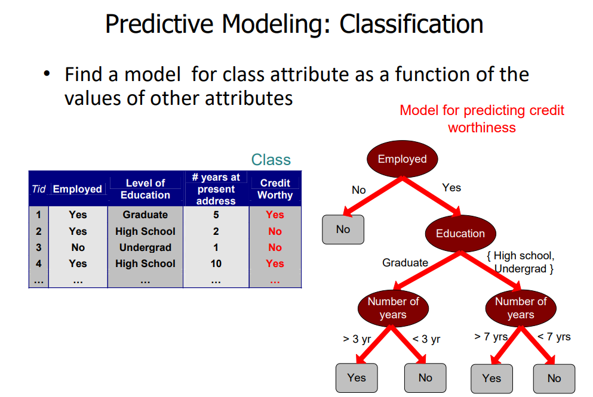
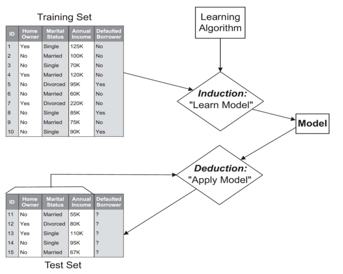
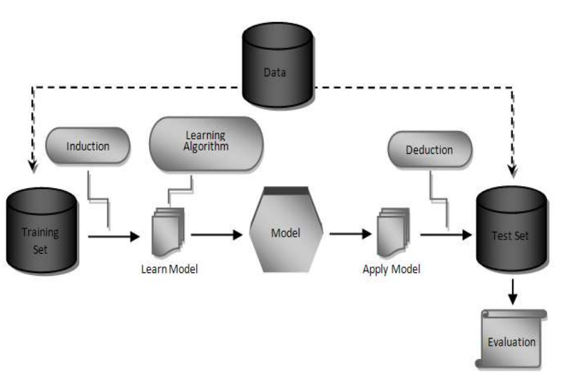

# IART 2021/2022: Credit Card Fraud - Supervised Learning

## Team members performance during learning, confusion matrix, precision, recall, accuracy, F1 measure and the time spent to train/test the models
- Juan Bellon [201908142]
- Luísa Araújo [201904996]
- Nuno Castro [202003324]

## How to run

Just open notebook and run it, make sure the notebook remains inside this folder so it can fetch the csv file from *files* folder

## Checkpoint 2

Power point:

1 - Specification of the work to be performed (definition of the machine learning problem to address);  
2 - Related work with references to works found in a bibliographic search (articles, web pages and/or source code);  
3 - Description of the tools and algorithms to use in the assignment;  
4 - Implementation work already carried;  

## What to do

- An initial exploratory data analysis should be carried out (class distribution, values per attribute, and
so on).
- Evaluation metrics: performance during learning, confusion matrix, precision, recall, accuracy, F1 measure and the time
spent to train/test the models
- Accuracy doesnt make sense.
- Model = Algorithm + Dataset

## Steps

- Dataset analysis 
- Identification of the target concept
- Definition of the train and test sets
- Selection and parameterization of the learning algorithms to employ
- Evaluation of the learning process
- Results comparsion: Matplotlib or Seaborn

## Algorithms

- Decision Trees
- Neural Networks (Deep Neural Networks)
- K-Nearest Neighbour Classifier
- Support Vector Machine
- Logistic Regression
- Rnadom Forest
- Naive Bayes
- Bayesian Belief Networks
- Rule-based Methods

Note: Use Scikit-Learn Python library to compare.

## Preprocessing

### FIRST

- Integration of data from various sources
- Bringing integrated data into common format

### SECOND

- <b> Dealing with missing data </b>
- Remove noise
- Remove outliers 
- <b> Dealing with duplicated data </b>
- Remove inconsistences

### THIRD

- Feature Scaling
- Dealing with Categorical data
- Dealing with Imbalanced data
- Dimension Reduction
- Feature Engineering
- Train test split of data

## Useful packages

- RapidMiner
- WEKA
- R
- Python libraries (see below)
- SPSS
- KNIME
- SAS Enterprise Miner
- Insightful Miner

## Python libraries/packages

- NumPy
- SciPy
- MatPlotLib
- IPython
- Pandas
- scikit learn
- OpenAI Gym (for unsupervised learning i think)
- TensorFlow
- Keras
- Machine Learning Agents

## Dataset

- Distance from home (where the transaction happened)
- Distance from the last transaction
- Ratio of purchased price to median purchased price
- Repeat Retailer (Bought from that retailer before)
- Used chip (used credit card)
- Used pin (used pin number)
- Online order
- Fraud

## Attribute analysis

### Nominal
Examples: ID Numbers, eye color, zip codes)

<b>Properties:</b> Distinctness

### Ordinal
Examples: rankings: 1-10, grades->A,B,C , height->tall, short)

<b>Properties:</b> Distinctness and Order.

### Interval
Examples: calendar dates, temperatures in Celsius or Fahrenheit)

<b>Properties:</b> Distinctness, Order and Meaningful differences

### Ratio
Exemplo: temperature in Kelvin, length, counts, elapsed time -> time to run a race)

<b>Properties:</b> Distinctness, Order, Meaningful differences and Meaningful ratios

## Properties of Attributes

- Distinctness: = !=
- Order: < >
- Meaningful Differences: + -
- Meaningful Ratios: * /

Distinctness and Order are Categorical Quantitive.

Interval and Ratio are Numeric Quantitive 

### Discrete vs Continuous Attributes

| Discrete | Continuous |
| -------- | ---------- |
| Finite set of values | Real numbers |
| zip codes, set of words, eye colours | Temperature, Height, Weight |
| Usually represented as Integer variables | Usually represented as Floating-point variables |

## Classification problems

# Credit Card Fraud

| Task | Attribute set (x) | Class Label (y) |
| - | - | - |
| Identify if a transaction is fraud or not | Distance from home (where the transaction happened), Distance from the last transaction, Ratio of purchased price to median purchased price, Repeat Retailer (Bought from that retailer before), Used chip (used credit card), Used pin (used pin number), Online order | Fraud (or not) |

Attribute | Type | Properties | Discrete vs Continuous |
| - | - | - | - |
| Distance from home | Ratio |  Distinctness, Order, Meaningful differences and Meaningful ratios | Continuous |
| Distance from last transaction | Ratio | Distinctness, Order, Meaningful differences and Meaningful ratios | Continuous |
| Ratio of purchased price to median purchased price | Ratio |  Distinctness, Order, Meaningful differences and Meaningful ratios | Continuous |
| Repeat Retailer | Nominal (binary) | Distinctness | Discrete |
| Used chip (used credit card) | Nominal (binary) | Distinctness | Discrete | 
| Used pin (used pin number) | Nominal (binary) | Distinctness | Discrete |
| Online Order | Nominal (binary) | Distinctness | Discrete |

Procedure:

